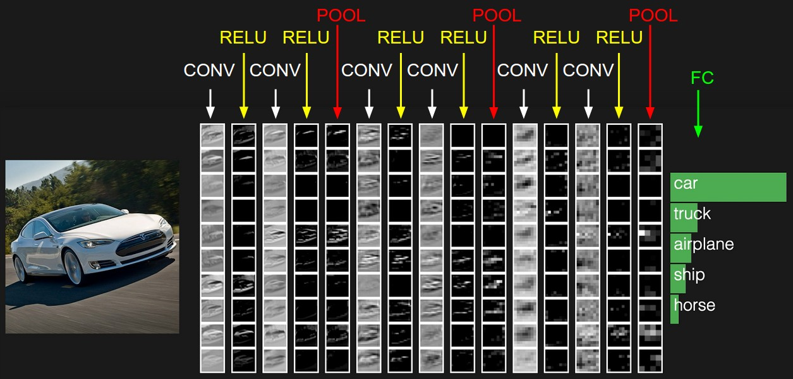

## CS231n 卷积神经网络

> 翻译自[斯坦福大学的cs231n课程](http://cs231n.github.io/convolutional-networks/)

[卷积神经网络(CNNs/ConvNets)](#卷积神经网络cnnsconvnets)
- [架构总览](#架构总览)
- [搭建卷积网络的层(Layers)](#搭建卷积网络的层layers)
- [卷积层](#卷积层)
- [池化层（Pooling Layer）](#池化层pooling-layer)
- [正规化层（Normalization Layer）](#正规化层normalization-layer)
- [全连接层](#全连接层)
- [将全连接层转化为卷积层](#将全连接层转化为卷积层)

[卷积网络的架构](#卷积网络的架构)
- [Layer Patterns](#layer-patterns)

[迁移学习](#迁移学习)

### 卷积神经网络(CNNs/ConvNets)

卷积神经网络的普通的神经网络有很多相似之处：他们都由神经元组成，这些神经元都有可学习的weights和biases。每个神经元接受一个输入，进行一次点乘运算（dot product），紧接着一次非线性的运算（也可能没有）。整个网络表达的是一个可微分的评价函数：输入的是图片的像素值，得到一个判断图片类别的评分。网络最后的全连接层也会有一个损失函数（SVM/Softmax）。

卷积网络和寻常的网络有何不同呢？卷积网络的输入必须是图片，因为输入是确定的，我们就可以对整个架构做一些特殊处理，使得前向的计算效率更高，同时能也减少网络的参数。

#### 架构总览

> 回忆：普通的神经网络接受一个输入，然后通过层层隐藏层（hidden layers）计算。每个隐藏层由若干个神经元（neurons）组成，每个神经元与前一个隐藏层的所有神经元连接，同层的神经元之间没有任何连接，也不共享任何参数。最后的全连接层（fully-connected layer）叫做输出层，在分类任务中，输出层负责输出每一个类别的得分。

普通神经网络没法拓展到处理图片。CIFAR-10数据集图片尺寸是32x32x3（宽=32，高=32，颜色通道=3），普通网络的第一个全连接层就需要有32x32x3=3072个参数。这个数字看起来可以接受，但稍大一些的图片，如200x200x3的图片就需要120000个参数，这还只是一个神经元，你肯定还想多要几个神经元，整个网络的参数数量会急剧膨胀！

卷积神经网络利用了输入由图片构成这一点对架构做了改善。和普通网络不用，ConvNet的神经元按照长(height)、宽(width)、深度(depth)三个维度组织。例如：CIFAR-10数据集的输入层的长度=32，宽度=32，深度=32。每一层的神经元都只会和前一层的一小块区域连接。处理CIFAR-10数据集的卷积网络的输出层维度会是1x10x10，因为最后一层我们会把原图缩成由类别得分构成的一个向量。

#### 搭建卷积网络的层（Layers）

卷积神经网络由层构成，每一层都将一个三维激活值矩阵通过一个可微函数转化成另一个矩阵。我们主要使用三种类型的层：卷积层（Convolutional Layer），池化层（Pooling Layer），和全连接层（Fully-Connected Layer）。我们就用这三种层堆叠出整个卷积网络的架构。

一个简单的、用来处理CIFAR-10数据集的卷积神经网络架构会是这样的：[INPUT -> CONV -> RELU -> POOL ->FC].

* INPUT [32x32x3] 是原始的图片，图片长宽分别为32，有三个颜色通道 R G B

* 卷积层会计算那些连接着输入层局部区域的神经元的输出，每一个神经元节点计算一次权重（weights）和输出层局部区域的点乘。卷积层计算完以后，输出的大小可能是[32x32x12]（如果我们打算使用12个过滤器的话）。

* RELU 层会执行激活函数，它保持没有改变输入的形状，输入还是[32x32x12].

* 池化层会在沿着水平方向（width和height的方向）执行一次下采样操作，缩小volume的尺寸，输出的形状大概会是 [16x16x12]

* FC layer（全连接层）会计算类别的得分，输出的形状会是[1x1x10]，向量中的每一个值是对应类别的得分（CIFAR-10数据集中的图片分属10个不同的类别）。全连接层的每一个神经元都会和前层的每一个神经元连接。

按照这样的方法，卷积网络将原始图片逐层转化成最后的类别得分。有些层有可训练的参数，有些层没有。卷积层/全连接层就是有参数的（有weights和bias参数），RELU/Pooling层就没有参数。卷积层和全连接层会使用梯度下降的方法训练，这样的话，在训练过程中我们整个卷积网络最后输出的类别得分就会向图片真实的类别靠近。

总结：

* 卷积神经网络一言以蔽之，就是通过层层网络结构，将一张图片计算成图片的类别得分。

* 常见的几种Layer结构有 CONV(卷积层)/FC(全连接层)/RELU/Pooling(池化层)。

* 每一层都接受一个3D的矩阵，经过计算，输出一个3D的矩阵，计算使用的函数是可微分的。

* 有些层有可训练的参数，有些层没有

* 有些层有超参数(CONV/FC/POOL)，有些层没有(RELU)

#### 卷积层

卷积层是卷积网络中的核心部件，大部分繁重的计算都是由卷积层计算的。

首先我们在不涉及人脑/神经的基础上理解一下卷积层干了什么事情。每个卷积层都由若干个过滤器(filters)构成，过滤器中包含了可学习的参数。每个过滤器都是一个小方块，他们沿着输入矩阵的长宽方向覆盖了整个input volume。举个例子，通常第一层的卷积层会使用5x5x3大小的filter（5x5是filter的长度和宽度，3是深度，深度和输入图像的颜色通道数量是一致的）。在前向传播的过程中，我们不断把这个filter沿着输入矩阵的长、宽方向滑动，每滑动一个位置，filter就和对应位置的输入区域做点乘(dot product)运算。这个滑动、计算的过程最终会产生一个2维的激活图（activation map）。直观来说，网络学到的filter会在看到一些特殊的形状时被激活（例如某些边缘、特殊色块、旋转），也可能被一些蜂窝状或轮子状的物体激活。现在我们有了一组filter，每个filter都能产生一个激活图。我们把这些激活图沿着depth方向叠在一起，就是卷积层的输出了。

我们再一次用人脑/神经相关的视角看一下卷积层，当处理图片这种高维度的信息时，使用单个神经元去“看”每一个图片的像素是不合理的。我们只把一个神经元和输入图片的一小片区域连接，这小片区域的大小是一个超参数，我们把他叫做神经元的感受野。

> 例1. 输入图片的尺寸是[32x32x3]（就是CIFAR-10图片的尺寸）。假如感受野的尺寸（更普遍的叫法是filter size）是5*5，卷积层的每一个神经元都会有一个指向原始图片相应的[5x5x3]区域的一个连接。

> 例2. 输入的尺寸是[16x16x20]（我们已经不能把它称为图片了）。我们使用的感受野大小为3x3，卷积层中每一个神经元都会有 3x3x20=180个参数。连接在沿着width、height这个方向是局部的，但在depth方向的全连接。

我们讲述了神经元和输入层的连接，但还没讨论和输出层的连接。有三个参数控制了卷积层的输出大小：depth（深度），stride（步长）和zero-padding（padding方式）。

- 首先，输出的深度是一个超参数，他对应我们使用的filter的数量，每层filter对输入数据的学习都有些差异。假如输入的是一张原始的图片，某些filter就会对不同方向的边缘产生激活，某些filter会对色块产生激活。

- 其次，我们必须制定滑动filter时候的步长（stride），stride==1的时候，每次只滑动一个像素，stride==k，每次就滑动k个像素，滑动步长越大，输出的面积就越小。

- 有的时候我们会对卷积层输入的边缘补上数值为0的列，到底补几列是超参数。这个参数也能决定卷积输出的大小。

卷积层的详细计算过程可以参考[课程网站上的动画](http://cs231n.github.io/convolutional-networks/#conv)

#### 池化层（Pooling Layer）

在连续的卷积层之间我们一般会插入Pooling层。Pooling层的作用是减小feature map的长和宽，减少了整个网络的参数数量和计算量，从而控制了过拟合。Pooling层在depth这个维度上是独立的。具体Pooling层的操作可以见下图

实践中只有两种常见的Max Pooling层：F=3, S=2（叫做重叠池化层），更常见的是 F=2,S=2。更大感受野的Pooling层不太常见，因为破坏性太强了。

还有一种Pooling叫做General pooling。和Max Pooling不一样的是，它不光可以在感受野内做Max()操作，还能做取平均值操作，average pooling计算的就是感受野内激活点的l2-norm。但是average pooling最近不太流行，被max pooling慢慢取代了，因为实践过程中max pooling工作得更好。

#### 正规化层（Normalization Layer）

Normalization Layer现在也不流行了，因为实践证明它们没什么作用。

#### 全连接层

全连接层的每一个神经元和前一层的所有激活点都有连接。

#### 将全连接层转化为卷积层

### 卷积网络的架构

前面的章节我们介绍过了组成卷积网络的基本layer，这一章我们讨论怎么把这些层堆叠构成完整的卷积网络

#### Layer Patterns

最常见的卷积层架构是把若干个 CONV + RELU 层堆叠在一起，紧接着再加一个Pooling层，重复这个模式直到层层计算后输入图片在尺度上越来越小，尺度小到一定程度，也可以替换成全连接+RELU层。最后的全连接层复杂整个网络的输出，例如输出图片的类别得分。最常见的卷积网络模式如下

`INPUT -> [[CONV -> RELU]*N -> POOL?]*M -> [FC -> RELU]*K -> FC`

`*`代表重复，`POOL?`代表这个池化层是可选项。一般来说 N>=0 并且 N <=3，M>=0，K>=0 并且 K<3。

比起一个大尺寸的感受野，若干个小尺寸的感受野更好些。加入我们将3个3x3的卷积层堆叠在一起（中间有RELU层实现非线性）。第一个卷积层的神经元就能看到输如图片中3x3的区域，第二个卷积层的神经元就能看到上层输出矩阵中的3x3区域，也就相当于看到输入图片中的5x5的区域，第三个卷积层的神经元能看到原始输入图片中的7x7大小的区域。如果我们用一个感受野为7x7大小的卷积层代替那3个小卷积，新卷积神经元的感受野大小和上述三个小卷积堆叠后的感受野大小是一样的，都是7x7，但有几个缺点。首先，之前三个小型卷积中间有非线性的RELU层，这个非线性能使特征更有表达力。其次，我们假定所有的卷积层都有C个通道，单个7x7的卷积层有 Cx7x7xC = 49xC^2 个参数，三个小卷积的堆叠只有 3x(Cx(3x3xC)) = 27xC^2 个参数，我们用更少的参数就得到了表现能力更强的网络。而且大尺寸的卷积在训练过程中占用更多的显存。

##### 实践：使用在ImageNet上表现最好的网络

思考并选择卷积网络架构可能让你感觉疲惫，在90%的应用中你没必要想这些东西。别逞能：与其自己费心想一个能用的卷积网络，不如找一个在ImageNet上识别效果最好的网络，下载一个预训练好的模型，然后在你自己的数据上调整网络参数。你没必要自己从头设计一个卷积网络。

### 迁移学习

实践中，很少有人从头开始训练整个卷积神经网络，因为很难找到足够多数据。一般会找一个在ImageNet上预训练好的网络，使用该网络的参数作为初始参数，或者使用某些层作为特征提取器。三种常见的迁移学习场景如下。

- ConvNet作为特征提取器。我们找一个在ImageNet上训练好的卷积模型，移除最后一个全连接层（这个Layer一般输出1000个类别的得分），把剩下的网络看成是新数据集的特征提取器。如果我们选取的是AlexNet的话，这个特征提取器对每一张图片会计算出一个4096-D的向量，我们把它叫做CNN的特征码。拿到4096-D的特征后，就可以训练一个线性分类器来分类新的数据集了。

- 微调ConvNet。第二个策略不仅要替换掉ConvNet输出端的全连接层，还要对预训练的网络参数重新训练。我们可以在新数据集训练的过程中更新所有Layer的参数，也可以只更新靠近输出端的若干层Layer的参数。这是因为我们观察到ConvNet靠近输入端的Layer输出的特征是非常通用的特征（比如图形的边缘、色块），这些Layer作为特征提取器对其他的视觉任务也会有效果。但是后面的一些Layer的作用就和当时训练用的数据集紧密相关了，那些Layer作为特征提取器，泛化能力不够强。拿ImageNet来说，ImageNet数据集包括很多狗的品种，那些在ImageNet上预训练的模型有很大一部分的表现能力都用来区别不同类型的狗了。

- 预训练的模型。现代的卷积网络训练ImageNet数据集需要2-3周时间，我们可以拿别人预训练好的模型文件拿来微调。caffe库就有个子项目Model ZOO，用来展示别人发布的预训练好的模型参数。

#### 如何微调

